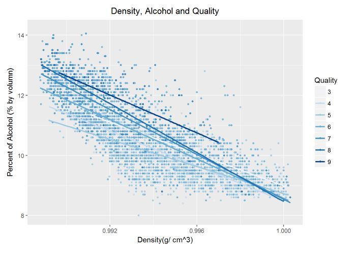
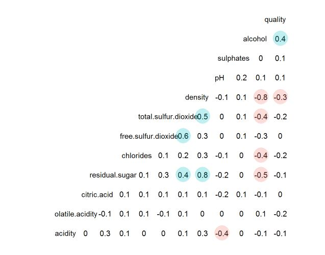

## White Wine Dataset Exploratory Data Analysis
Language: R (ggplot2, dplyr, memisc, GGally, gridExtra)  
Skills: Inferential Statistics, Data Visualization  
Used histograms, boxplots, scatter plots and correlation matrix to explore and visualize the White Wine dataset. 
The relationships between the variables have been investigated by computing Pearson Correlation tests and 
the multiple linear regression.

 

  

 

  

   
